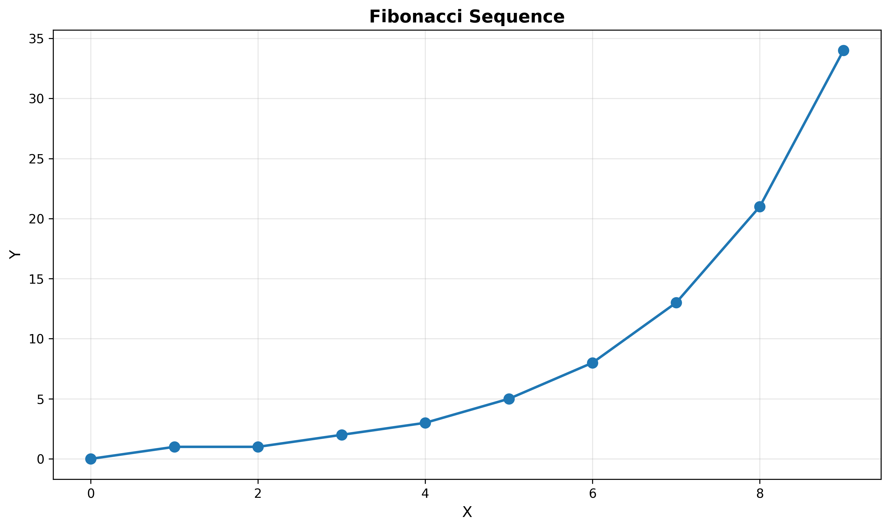
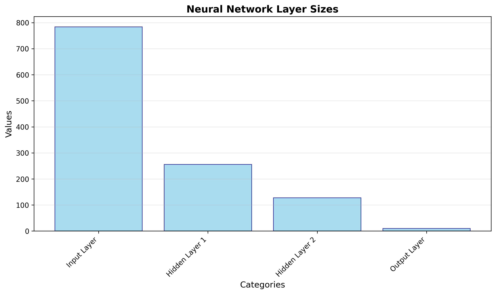

# 🤖 Advanced Research Agent

A sophisticated AI agent built with LangChain and LangGraph that can perform research, calculations, data analysis, visualization, and PDF processing. All outputs are automatically organized in timestamped folders.

## ✨ Features

- 🔍 **Web Research**: Search the web and Wikipedia
- 🧮 **Mathematical Calculations**: Advanced calculator with scientific functions
- 📊 **Data Visualization**: Create professional plots (line, bar, scatter, pie, histogram)
- 📈 **Statistical Analysis**: Compute statistics and analyze data distributions
- 💻 **Code Execution**: Safely run Python code
- 📄 **PDF Processing**: Read local PDFs and download from URLs
- 💾 **Smart Output Management**: All files automatically organized in `outputs/{DATE}_{TOPIC}/`
- 🌤️ **Weather Information**: Get weather data (simulated, ready for API integration)
- 📝 **Text Summarization**: Summarize long documents

## 🚀 Quick Start

### Installation

1. **Clone the repository:**
```bash
git clone https://github.com/inakiLakunza/advanced-research-agent.git
cd advanced-research-agent
```

2. **Create virtual environment:**
```bash
python -m venv venv
source venv/bin/activate  # On Windows: venv\Scripts\activate
```

3. **Install dependencies:**
```bash
pip install -r requirements.txt
```

4. **Set up environment variables:**
Create a `.env` file in the root directory:
```
OPENAI_API_KEY=your_openai_api_key_here
```

### Usage

Run the agent:
```bash
python main.py
```

Enter your query when prompted. Examples:
- `Calculate the first 15 Fibonacci numbers and create a plot`
- `Research quantum computing and save a summary`
- `Read PDF from /path/to/file.pdf and analyze key points`
- `Download PDF from https://example.com/paper.pdf and summarize`

## 📁 Output Structure

All outputs are automatically saved in organized folders:

```
outputs/
├── 20241227_143052_fibonacci_numbers/
│   ├── session_summary.txt
│   ├── fibonacci_plot.png
│   └── results.txt
├── 20241227_150423_quantum_computing/
│   ├── session_summary.txt
│   └── research_summary.txt
└── 20241227_152301_pdf_analysis/
    ├── session_summary.txt
    ├── downloaded_paper.pdf
    └── analysis.txt
```

Each folder is named: `{YYYYMMDD_HHMMSS}_{TOPIC}`

---

## 🎯 Real-World Examples

### Example 1: Fibonacci Sequence Generation & Visualization

**Query:**
```
Generate Fibonacci sequence and create a plot
```

**Output:**
The agent generates the first 10 Fibonacci numbers `[0, 1, 1, 2, 3, 5, 8, 13, 21, 34]` and creates a professional visualization showing exponential growth.

**Generated Plot:**



**Session Summary:**
```
Agent Session Summary
==================================================
Timestamp: 2025-12-27 13:44:42

User Query: Generate Fibonacci sequence and create a plot

Agent Response:
I generated the Fibonacci sequence, which is: [0, 1, 1, 2, 3, 5, 8, 13, 21, 34]. 

Additionally, I created a line plot of the Fibonacci sequence and saved it as 
**fibonacci_growth.png** in the output folder.

Tool Calls: 4
Output Folder: outputs/20251227_134435_generate_fibonacci
```

**Files Created:**
- `fibonacci_growth.png` - Line plot with markers
- `session_summary.txt` - Complete execution log

---

### Example 2: Research with Multi-Tool Workflow

**Query:**
```
Research machine learning on Wikipedia, calculate how many neurons would be in a 4-layer 
neural network with sizes [784, 256, 128, 10], create a bar chart of layer sizes, 
and save everything to a report
```

**Output:**
The agent conducts Wikipedia research, performs calculations (1,178 total neurons), creates a bar chart visualization, and compiles everything into a comprehensive report.

**Generated Visualization:**



**Research Report Extract:**
```
Machine Learning Research Report:

Machine Learning Overview:
Machine learning (ML) is a field of study in artificial intelligence concerned 
with the development and study of statistical algorithms that can learn from data 
and generalize to unseen data, and thus perform tasks without explicit instructions.

Neural Network Neurons Calculation:
Total neurons in a 4-layer neural network with sizes [784, 256, 128, 10]: 1178

Neural Network Layer Sizes Visualization:
Bar chart of the layer sizes saved as 'neural_network_layer_sizes.png'.
```

**Tools Used:**
- `wiki_tool` - Research machine learning
- `calculator_tool` - Sum neurons across layers
- `plot_tool` - Create bar chart
- `save_tool` - Generate report

**Files Created:**
- `neural_network_layer_sizes.png` - Bar chart visualization
- `machine_learning_report.txt` - Complete research report
- `session_summary.txt` - Execution trace

---

### Example 3: Researcher Profile Analysis

**Query:**
```
I want you to do a full research of the following person: Iñaki Lacunza. 
There are two people with the following name, I want you to focus on the 
researcher, not the singer. Get info from him, point all the links you have 
searched and the info you have got from each of them
```

**Output:**
The agent performs multi-source research, distinguishes between individuals with the same name, extracts publication details, and compiles a comprehensive profile.

**Research Summary Extract:**
```
Researcher Name: Iñaki Lacunza

Sources:
1. Search Tool - Found multiple mentions, including collaborations on research papers 
   and projects in machine translation and visual language models.
   
2. Wikipedia - Retrieved mentions of Iñaki Lacunza in relation to his work on projects 
   and publications, including a reference to the EURAXESS initiative for talent 
   mobility in research.
   
3. Additional Search - Found specific publications and projects by Iñaki Lacunza

Notable Publications:
• ACADATA: Parallel Dataset of Academic Data for Machine Translation
• Breaking Language Barriers in Visual Language Models via Multilingual Textual Regularization
• XDoGE: Multilingual Data Reweighting to Enhance Language Inclusivity in LLMs

These publications can be found on platforms like arXiv for further details.
```

**Tools Used:**
- `search_tool` - Web search with DuckDuckGo
- `wiki_tool` - Wikipedia research
- `save_tool` - Compile findings into report

**Files Created:**
- `Iñaki_Lacunza_research_summary.txt` - Complete research profile
- `session_summary.txt` - Execution log with all sources

---

## 🛠️ Available Tools

| Tool | Description | Example |
|------|-------------|---------|
| `wiki_tool` | Query Wikipedia | "quantum computing" |
| `search_tool` | Web search via DuckDuckGo | "latest AI trends 2024" |
| `calculator_tool` | Math calculations | "sqrt(144) + 2**3" |
| `plot_tool` | Create visualizations | JSON data + plot type |
| `data_analysis_tool` | Statistical analysis | "[10,20,30,40,50]" |
| `code_executor_tool` | Run Python code safely | "print('Hello')" |
| `pdf_reader_tool` | Read local PDF | "/path/to/file.pdf" |
| `url_pdf_reader_tool` | Download & read PDF | "https://example.com/paper.pdf" |
| `save_tool` | Save to file | data + filename |
| `file_reader_tool` | Read text files | "data.txt" |
| `weather_tool` | Get weather info | "London" |
| `summarize_tool` | Summarize text | text + max_length |

## 💡 More Example Queries

### Basic Calculations
```
Calculate 2^10 + sqrt(144)
```

### Data Analysis
```
Analyze these test scores: [85, 92, 78, 95, 88, 76, 91, 89] and create a visualization
```

### PDF Processing
```
Read the PDF from /home/user/research_paper.pdf and extract key findings
```

### URL PDF Download
```
Download PDF from https://arxiv.org/pdf/2301.07041.pdf and summarize the abstract
```

## 🔧 Configuration

### Adjust Model Settings

In `main.py`, modify the LLM configuration:
```python
llm = ChatOpenAI(
    model="gpt-4o-mini",  # Change model
    temperature=0.7,       # Adjust creativity (0.0-1.0)
    max_tokens=2000        # Adjust response length
)
```

### Add New Tools

1. Create your tool in `tools.py`:
```python
@tool
def your_tool(param: str) -> str:
    """
    Description of your tool.
    
    Args:
        param: Parameter description
    """
    # Your implementation
    return "Result"
```

2. Import and add to `main.py`:
```python
from tools import your_tool

tools = [
    # ... existing tools
    your_tool
]
```

## 📊 Architecture

```
┌─────────────┐
│   main.py   │  Entry point, creates output folders
└──────┬──────┘
       │
       ▼
┌─────────────┐
│ LangGraph   │  Agent orchestration, tool selection
│   Agent     │
└──────┬──────┘
       │
       ▼
┌─────────────┐
│  tools.py   │  12+ specialized tools
└─────────────┘
       │
       ▼
┌─────────────┐
│  outputs/   │  Organized results
└─────────────┘
```

## 🤝 Contributing

Contributions are welcome! Please feel free to submit a Pull Request.

1. Fork the repository
2. Create your feature branch (`git checkout -b feature/AmazingFeature`)
3. Commit your changes (`git commit -m 'Add some AmazingFeature'`)
4. Push to the branch (`git push origin feature/AmazingFeature`)
5. Open a Pull Request

## 📝 License

This project is licensed under the MIT License - see the LICENSE file for details.

## 🙏 Acknowledgments

- Built with [LangChain](https://www.langchain.com/)
- Agent framework: [LangGraph](https://github.com/langchain-ai/langgraph)
- LLM: OpenAI GPT-4o-mini

## 📧 Contact

**Iñaki Lacunza** - Deep Learning Research Engineer

- [LinkedIn](https://www.linkedin.com/in/inaki-lacunza-castilla/)
- [Google Scholar](https://scholar.google.com/citations?user=e7huPQcAAAAJ&hl=es)
- [GitHub](https://github.com/inakiLakunza)
- [Barcelona Supercomputing Center](https://www.bsc.es/es/lacunza-castilla-inaki)

CV available in LinkedIn

**Project Link:** [https://github.com/inakiLakunza/advanced-research-agent](https://github.com/inakiLakunza/advanced-research-agent)

---

⭐ If you find this project useful, please consider giving it a star!